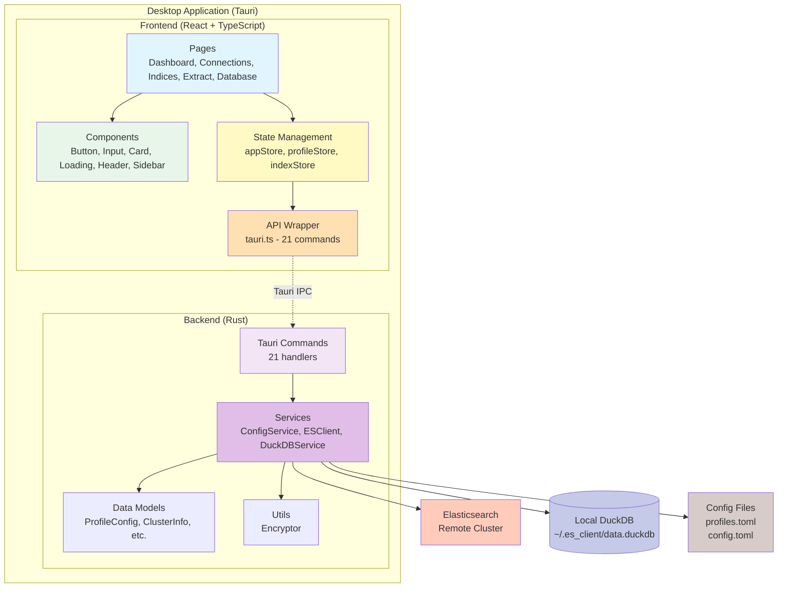
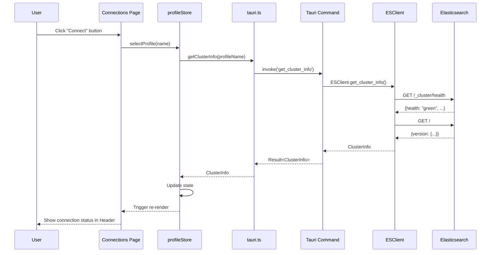
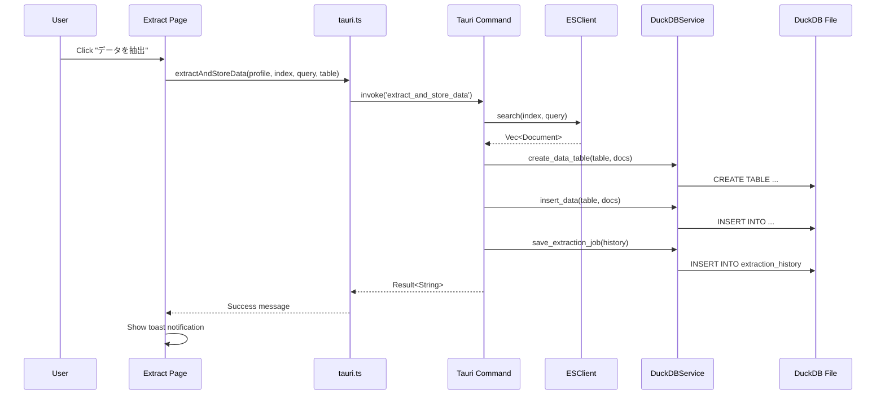
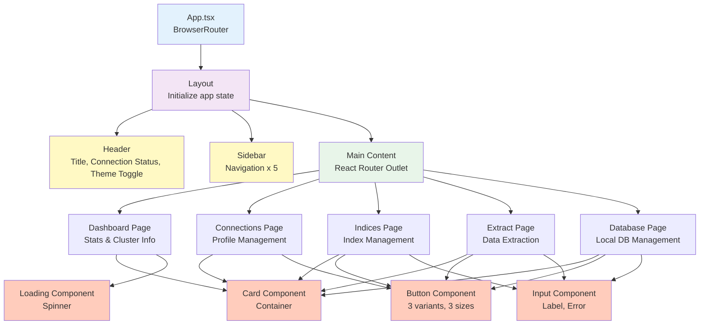
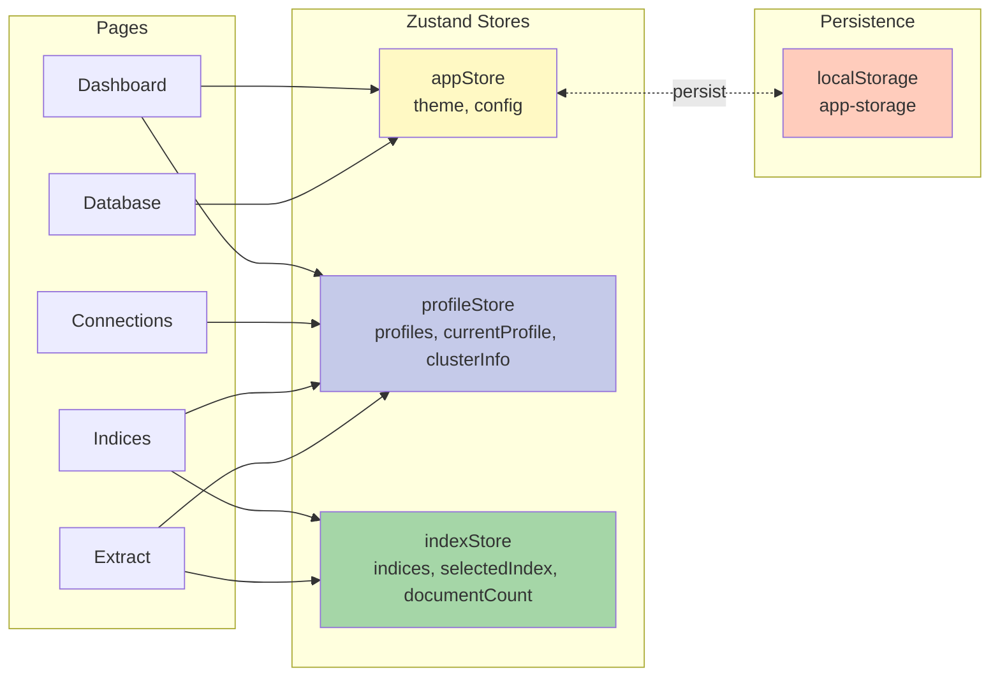
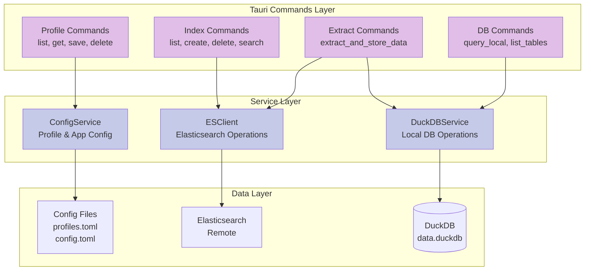
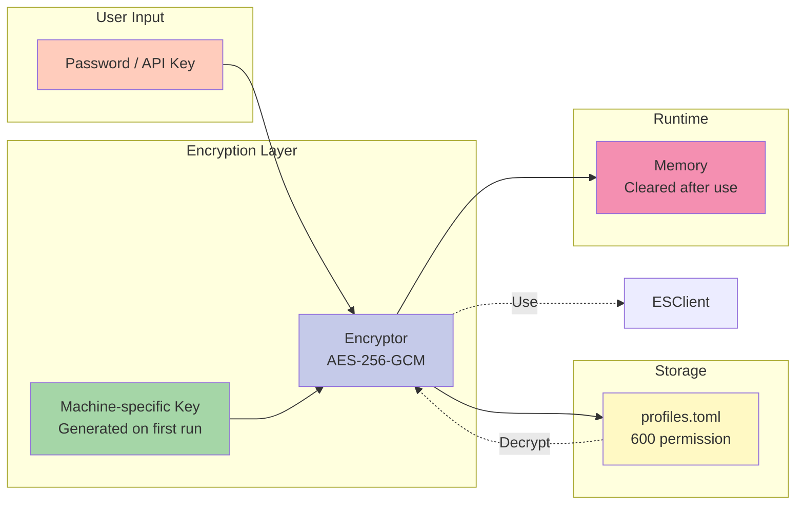
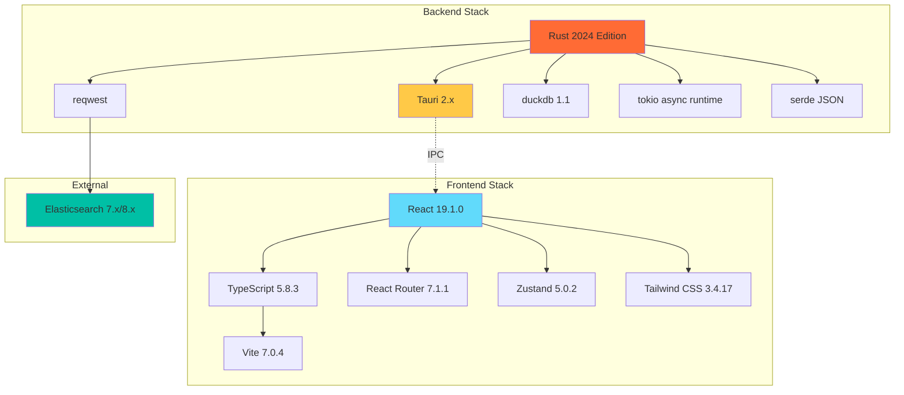

# ES Client - アーキテクチャ図

**最終更新:** 2025-11-25

## 1. システム全体アーキテクチャ

## 2. データフロー - 接続管理

## 3. データフロー - データ抽出

## 4. コンポーネント階層

## 5. 状態管理 (Zustand)

## 6. バックエンドアーキテクチャ

## 7. セキュリティ層

## 8. テクノロジースタック

## 9. Draw.io変換手順

このMermaid図をDraw.ioで使用するには:

### 方法1: 手動再作成
1. Draw.ioを開く
2. 上記の図を参考に手動で作成
3. レイアウトを調整

### 方法2: Mermaid Live Editorを使用
1. https://mermaid.live にアクセス
2. 上記のMermaidコードをコピー&ペースト
3. SVGまたはPNGでエクスポート
4. Draw.ioにインポート

### 方法3: VS Code拡張機能を使用
1. "Mermaid Markdown Syntax Highlighting"拡張機能をインストール
2. このファイルをVS Codeで開く
3. プレビューを表示
4. スクリーンショットを取得

## 10. 主要な設計判断

### 10.1 フロントエンド
- **React Router v7**: 最新のルーティングAPIとデータローディング
- **Zustand**: Reduxよりシンプルで軽量な状態管理
- **Tailwind CSS**: ユーティリティファーストで高速開発
- **Headless UI**: アクセシビリティに配慮した基礎コンポーネント

### 10.2 バックエンド
- **Rust 2024 Edition**: 最新の言語機能とモジュールシステム
- **reqwest**: 非同期HTTPクライアント、Elasticsearchとの通信
- **DuckDB**: 軽量で高速なOLAPデータベース
- **AES-256-GCM**: 業界標準の暗号化アルゴリズム

### 10.3 アーキテクチャパターン
- **コンポーネント分離**: UI/Layout/Pageの3層構造
- **状態管理の分離**: アプリ/プロファイル/インデックスで責務分割
- **サービス層**: ビジネスロジックをコマンドハンドラから分離
- **エラー境界**: 各層で適切なエラーハンドリング
